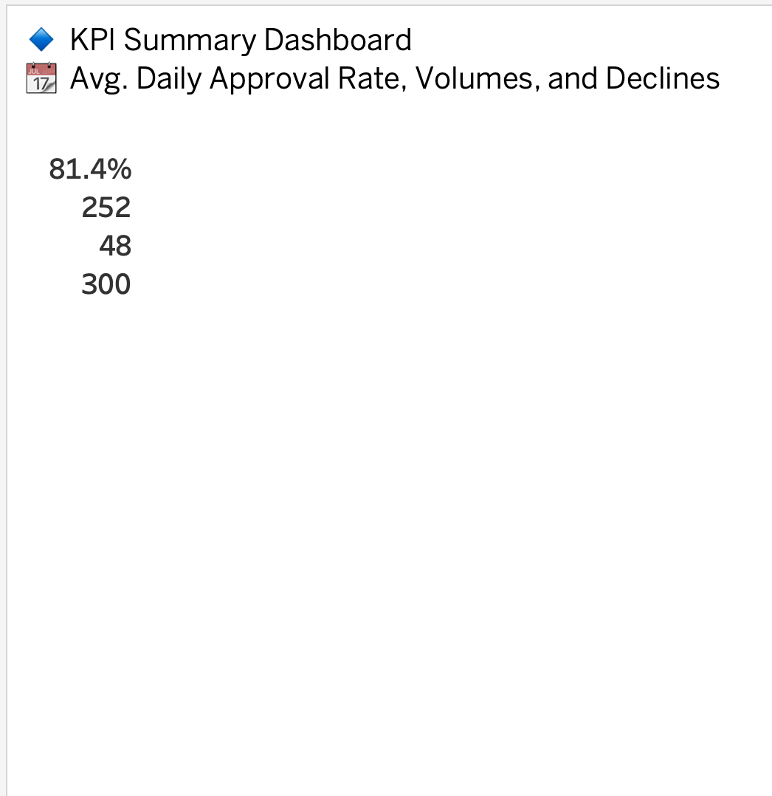
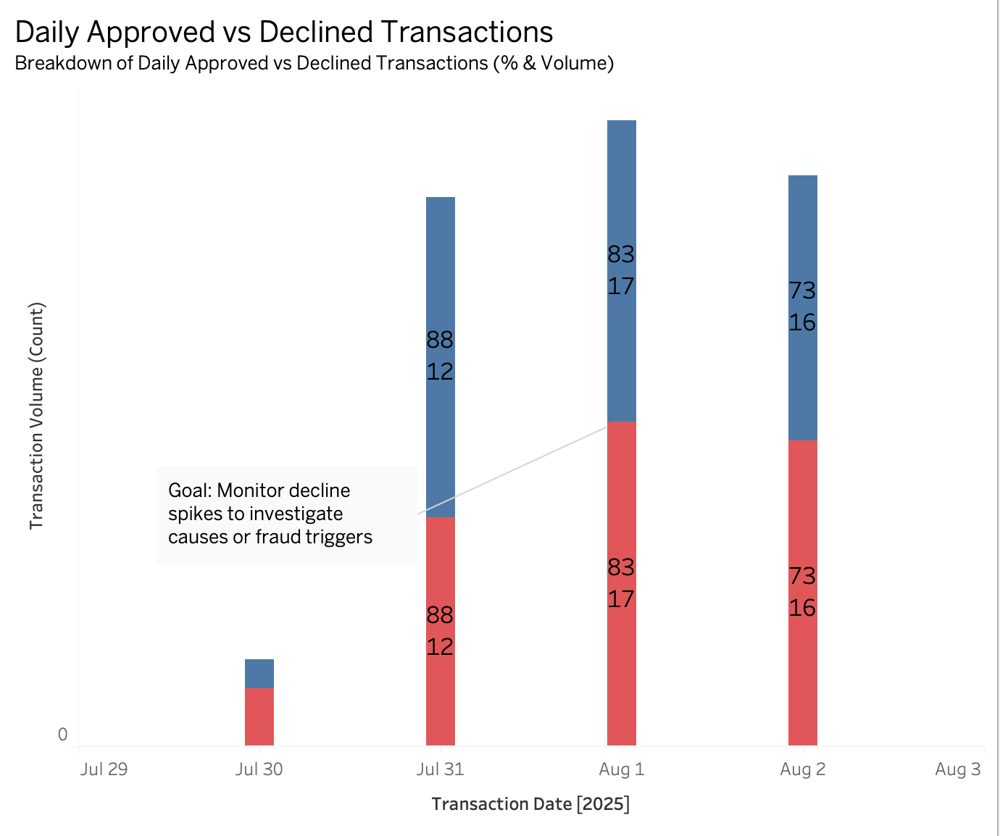
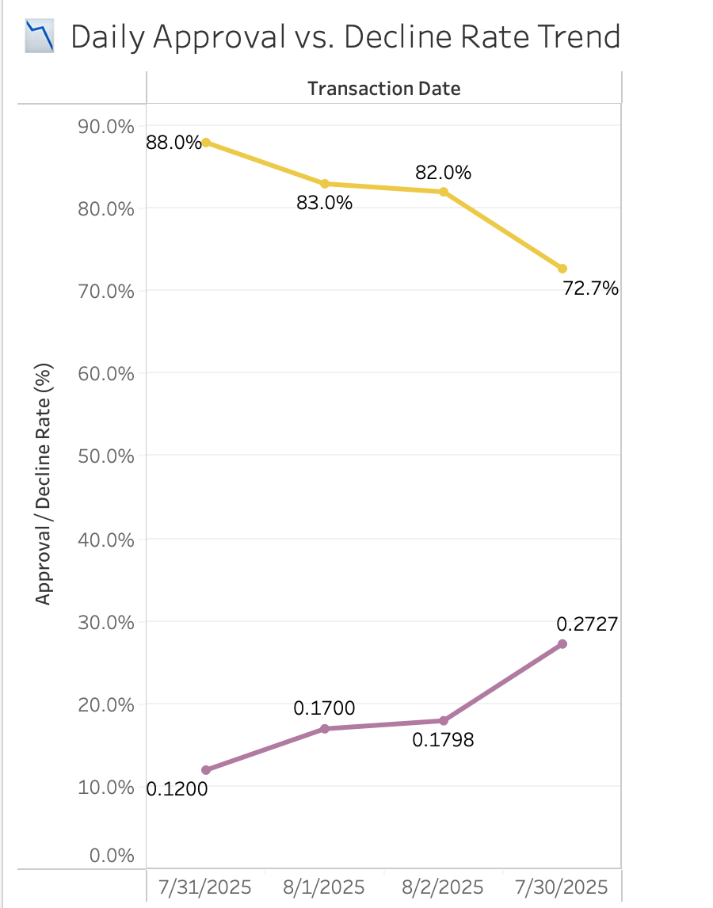
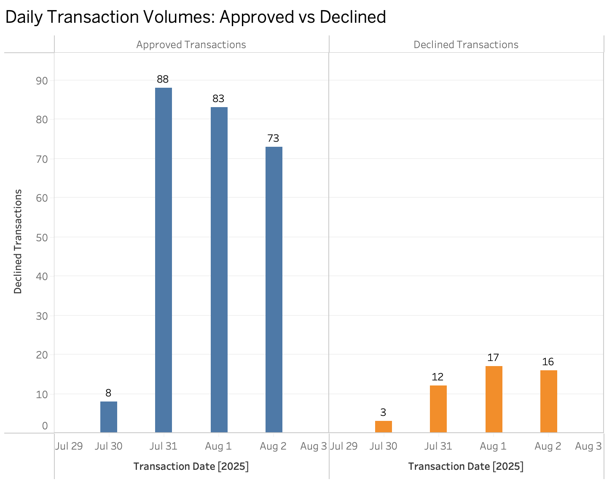

# 🔐 Daily Approval Rate Data Pipeline

This project simulates a real-world data pipeline that calculates and visualizes daily transaction approval rates. Built using **Python**, **Airflow**, and **Tableau**, it demonstrates how to orchestrate ETL workflows, summarize transaction metrics, and communicate insights through a clean dashboard.

---

## 🚀 Overview

- ✅ Simulate daily merchant transaction data (approved/declined)
- 🐍 Python script to calculate approval KPIs
- 🗂️ Save outputs as CSV for visualization
- 🛠️ Schedule with Apache Airflow
- 📊 Build interactive dashboard in Tableau

---

## 📁 Project Structure

auth-approval-pipeline/
├── airflow_dags/
│ ├── auth_pipeline_dag.py
│ └── images/
│ ├── Screenshot_1.png
│ ├── Screenshot_2.png
│ └── Screenshot_3.png
├── dashboard/
│ └── Tableau_Screenshot.twb
├── data/
│ ├── daily_transactions.csv
│ └── daily_approval_summary.csv
├── notebooks/
├── sql/
├── requirements.txt
└── README.md

----

---

## ⚙️ How It Works

1. **Simulated Dataset**: `daily_transactions.csv` contains 4 days of merchant transactions with fields like `status`, `amount`, and `timestamp`.

2. **Python DAG**: `auth_pipeline_dag.py`:
   - Reads raw CSV data
   - Calculates total, approved, and declined transaction counts
   - Derives daily approval rate percentage
   - Saves `daily_approval_summary.csv` to the `data/` folder

3. **Airflow**: Schedules and runs the DAG daily.

4. **Tableau Dashboard**: Displays approval trends, volumes, and performance summaries.

---

### 📊 KPI Summary Dashboard  

### 📈 Approval vs Decline Volume  

### 📉 Auth Trend Chart  

### 🔄 Volume Trend Comparison  

---

## ✅ What I Learned

- Orchestrating data workflows using **Airflow**
- Writing modular Python ETL scripts with **Pandas**
- Calculating approval metrics across multiple days
- Creating clear and visual **Tableau** dashboards
- Managing code and assets using **Git & GitHub**

---

## 📌 Challenges Faced

- Simulating realistic transaction data for test purposes  
- Dynamically calculating metrics from raw CSV input  
- Rendering images correctly on GitHub  
- Balancing dashboard clarity with clean design  

---

## 🚧 Next Steps

- Add **email alerts** on DAG failure in Airflow  
- Upload dashboard to **Streamlit** for stakeholder demo  
- Connect to cloud storage or data warehouse (e.g., **Snowflake**, **BigQuery**)  

---

## 💻 Tech Stack

- Python 3.10  
- Apache Airflow  
- Pandas  
- Tableau  
- Git / GitHub  

---

## 🧠 Author

**Myke Tzul** – [LinkedIn](https://www.linkedin.com/in/mykeil-tzul) | [GitHub](https://github.com/Mykeil-tzul)

